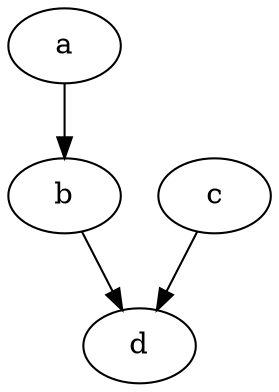

# markdown-with-math

$$x = 100 * y + z - 10 / 33 + 10 % 3$$

```math
x = 100 * y + z - 10 / 33 + 10 % 3
```

```latex
x = 100 * y + z - 10 / 33 + 10 % 3
```



```dot
digraph x {
    a->b;
    b->d;
    c->d;
}
```
