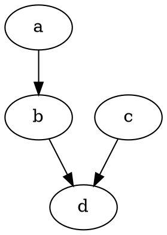

# Github 功能试验

$$
x = 100 * y + z - 10 / 33 + 10 % 3
$$

```math
E = mc^{2}
```

```math
x = 100 * y + z - 10 / 33 + 10 % 3
```

```latex
x = 100 * y + z - 10 / 33 + 10 % 3
```

```tex
x = 100 * y + z - 10 / 33 + 10 % 3
```





```gv
digraph x {
    a->b;
    b->d;
    c->d;
}
```

<table border="0">
    <tr>
        <th>CPU</th>
        <th>内存</th>
        <th>主板</th>
    </tr>
    <tr>
        <td></td>
        <td></td>
        <td></td>
    </tr>
</table>

<style>
.wrapper {
    width: 376.2px; height: 128px;
    top: 0px; margin-top: 26px; /* top: -40px; margin-top: 26px; */
    position: relative;
}

.incubating {
    cursor: pointer;
    position: absolute;
    border: 2px solid rgb(83, 113, 189);
    width: 72px;
    height: 59px;
}

.incubating-img {
    width: 65px; height: 43px; margin: 2px; padding: 2px;
}

.incubating-tip {
    position: absolute; left: 0px; right: 0px; bottom: 0px; height: 10px; text-align: center; background: rgb(83, 113, 189); color: white; font-size: 6.7px; line-height: 13px;
}

.sandbox {
    cursor: pointer; position: absolute; top: 0px; width: 36px; height: 32px;
}

.sanbox-img {
    width: 34px;
    height: 30px;
    margin: 2px;
    padding: 2px;
    border: 1px solid grey;
    border-radius: 3px;
}

.sanbox-img-bg {
    background: rgb(238, 238, 238)
}
</style>

<div class="wrapper">
    <div style="left: 3px; top: 3px" class="incubating">
        
        <div class="incubating-tip">CNCF Incubating</div>
    </div>
    <div style="left: 75.6px; top: 0px" class="sandbox">
        
    </div>
    <div style="left: 113.4px; top: 0px" class="sandbox">
        
    </div>
    <div style="left: 151.2px; top: 0px" class="sandbox">
        </div>
    <div style="left: 189px; top: 0px" class="sandbox">
        
    </div>
    <div style="left: 226.8px; top: 0px" class="sandbox">
        
    </div>
    <div style="left: 264.6px; top: 0px" class="sandbox">
        
    </div>
    	<div style="left: 302.4px; top: 0px" class="sandbox">
		
	</div>
    <div style="left: 340.2px; top: 0px" class="sandbox">
    	
    </div>
    <div style="left: 75.6px; top: 32px" class="sandbox">
    	
    </div>
    <div style="left: 113.4px; top: 32px" class="sandbox">
    	
    </div>
    <div style="left: 151.2px; top: 32px" class="sandbox">
    	
    </div>
    <div style="left: 189px; top: 32px" class="sandbox">
    	
    </div>
    <div style="left: 226.8px; top: 32px" class="sandbox">
    	
    </div>
    <div style="left: 264.6px; top: 32px" class="sandbox">
    	
    </div>
    <div style="left: 302.4px; top: 32px" class="sandbox">
    	
    </div>
    <div style="left: 340.2px; top: 32px" class="sandbox">
    	
    </div>
    <div style="left: 0px; top: 64px" class="sandbox">
    	
    </div>
    <div style="left: 37.8px; top: 64px" class="sandbox">
    	
    </div>
    <div style="left: 75.6px; top: 64px" class="sandbox">
    	
    </div>
    <div style="left: 113.4px; top: 64px" class="sandbox">
    	
    </div>
    <div style="left: 151.2px; top: 64px" class="sandbox">
    	
    </div>
    <div style="left: 189px; top: 64px" class="sandbox">
    	
    </div>
    <div style="left: 226.8px; top: 64px" class="sandbox">
    	
    </div>
    <div style="left: 264.6px; top: 64px" class="sandbox">
    	
    </div>
    <div style="left: 302.4px; top: 64px" class="sandbox">
    	
    </div>
    <div style="left: 340.2px; top: 64px" class="sandbox">
    	
    </div>
    <div style="left: 0px; top: 96px" class="sandbox">
    	
    </div>
    <div style="left: 37.8px; top: 96px" class="sandbox">
    	
    </div>
    <div style="left: 75.6px; top: 96px" class="sandbox">
    	
    </div>
    <div style="left: 113.4px; top: 96px" class="sandbox">
    	
    </div>
    <div style="left: 151.2px; top: 96px" class="sandbox">
    	
    </div>
    <div style="left: 189px; top: 96px" class="sandbox">
    	
    </div>
    <div style="left: 226.8px; top: 96px" class="sandbox">
    	
    </div>
</div>

