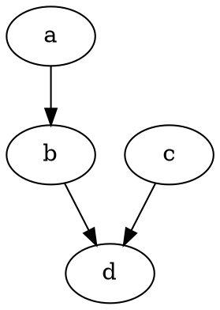

# Github 功能试验

$$
x = 100 * y + z - 10 / 33 + 10 % 3
$$

```math
E = mc^{2}
```

```math
x = 100 * y + z - 10 / 33 + 10 % 3
```

```latex
x = 100 * y + z - 10 / 33 + 10 % 3
```

```tex
x = 100 * y + z - 10 / 33 + 10 % 3
```





```gv
digraph x {
    a->b;
    b->d;
    c->d;
}
```

<table border="0">
    <tr>
        <th>CPU</th>
        <th>内存</th>
        <th>主板</th>
    </tr>
    <tr>
        <td></td>
        <td></td>
        <td></td>
    </tr>
</table>
